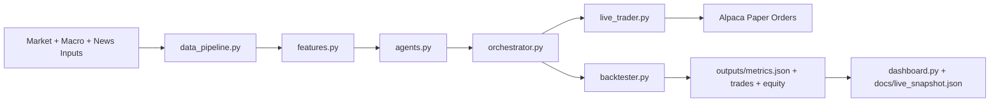

# Multi-Agent Alpha Generator

[](https://github.com/kanupriya1190/multi-agent_alpha_generator/actions/workflows/ci.yml)

Production-style multi-agent trading research system that turns market, macro, and sentiment inputs into risk-managed portfolio actions, with backtesting, live paper execution, API serving, and public monitoring.

## Why This Project

Most strategy demos stop at a notebook. This project implements the full path from signal research to executable portfolio decisions:

- multi-agent signal generation,
- risk-aware orchestration and position sizing,
- historical validation,
- live Alpaca paper-trading,
- and public dashboarding.

## Results Snapshot

Current portfolio universe: `NVDA`, `MSFT`, `GOOG`, `TLT`, `CRWV`, `NBIS`, `BE`.

- Annual Return: **4.08%**
- Sharpe Ratio: **1.07**
- Max Drawdown: **4.94%**
- Trades: **2,567**

## Live Links

- Streamlit Dashboard: [Open live dashboard](https://your-streamlit-app-url.streamlit.app)
- Public Snapshot Page (for GitHub visitors): [Open snapshot page](https://kanupriya1190.github.io/multi-agent_alpha_generator/)
- Latest Snapshot JSON: [Open live snapshot JSON](https://kanupriya1190.github.io/multi-agent_alpha_generator/live_snapshot.json)

## Technical Differentiators

- **Ensemble strategy design**: Momentum, Mean Reversion, Sentiment, Bond-Yield, and Macro-Risk agents.
- **Execution-aware orchestration**: one decision layer outputs signal, confidence, and risk-clipped position size.
- **Robust runtime behavior**: market/macro/sentiment fallbacks keep the system operable under API and dependency failures.
- **End-to-end deployment**: backtest + API + Streamlit + scheduled live cycle in one repository.

### Alpaca Integration At A Glance

This project uses Alpaca Paper Trading directly (runtime does not require MCP):
- Auth via `ALPACA_API_KEY` + `ALPACA_SECRET_KEY`
- Pulls account, positions, and orders
- Places market orders from strategy output
- Supports `dry_run` and live execution

## What This Project Does

This project:
1. Ingests market, macro, and sentiment-related inputs.
2. Builds engineered features.
3. Produces `BUY / SELL / HOLD` with an ensemble of rule-based agents.
4. Sizes positions with risk controls.
5. Backtests over multi-year history.
6. Runs live paper-trading with optional stats-arbitrage adjustments.
7. Exposes API + dashboard for monitoring and execution.

---

## Current Universe

Configured symbols (in `config.py`):
- `NVDA`
- `MSFT`
- `GOOG`
- `TLT` (bond ETF)
- `CRWV` (CoreWeave)
- `NBIS` (Nebius)
- `BE` (Bloom Energy)

---

## Architecture



- `config.py` - central settings (symbols, dates, risk limits, paths, keys)
- `data_pipeline.py` - market/macro/sentiment data ingestion + storage
- `features.py` - feature engineering (momentum, volatility, macro, sentiment)
- `agents.py` - strategy agents (momentum, mean reversion, sentiment, bond yield, macro risk)
- `orchestrator.py` - weighted signal ensemble + confidence + sizing
- `backtester.py` - historical simulation + performance metrics
- `live_trader.py` - Alpaca paper execution + rebalance + stats-arb
- `live_trade.py` - CLI wrapper for one-cycle live run
- `api.py` - FastAPI inference + live trading endpoints
- `dashboard.py` - Streamlit frontend

---

## Signal Logic (Important)

Final signal is generated from weighted agent scores:
- **Momentum Agent**: trend-following
- **Mean Reversion Agent**: z-score/volume contrarian
- **Sentiment Agent**: sentiment + sentiment momentum + price momentum
- **Bond Yield Agent**: yield-regime logic (equities vs bond ETFs)
- **Macro Risk Agent**: VIX and macro stress risk scaling

Then orchestrator decides:
- `BUY` if ensemble score > `0.15`
- `SELL` if ensemble score < `-0.15`
- `HOLD` otherwise

Position sizing is dynamic via confidence, macro-risk multiplier, and drawdown guardrails.

---

## How Sentiment Is Currently Run

Sentiment is currently **proxy-based**, not direct NLP from NewsAPI yet:

### Backtest / Data Pipeline
In `data_pipeline.py` (`fetch_sentiment_data`):
- computes `ret_3d` and `ret_10d` per symbol
- blends them into a proxy sentiment score
- maps score into `[0, 1]`

### Live Trading
In `live_trader.py` (`_build_signal_row`):
- computes proxy sentiment from recent price behavior
- fetches recent ticker-specific headlines from NewsAPI
- scores those headlines with Hugging Face FinBERT (`ProsusAI/finbert`)
- blends both into final live `sentiment_score`:
  - `0.6 * news_sentiment + 0.4 * proxy_sentiment`
- computes `sentiment_momentum` from rolling sentiment behavior

Fallback behavior:
- If NewsAPI or FinBERT is unavailable, strategy falls back safely to proxy sentiment.

---

## Stats-Arb + Rebalancing (Live Paper Mode)

Live mode (`live_trader.py`) can:
- compute pair spread z-scores (stats-arb diagnostics),
- tilt target weights by pair regime,
- rebalance current holdings to target weights,
- enforce directional consistency (e.g., `SELL` -> target weight `0`).

Default in live runs:
- `use_stats_arb=True`
- `rebalance=True`

---

## Setup

```bash
python -m venv venv
source venv/bin/activate
pip install -r requirements.txt
cp .env.example .env
```

Set keys in `.env`:
- `ALPACA_API_KEY`
- `ALPACA_SECRET_KEY`
- `FRED_API_KEY` (recommended)
- `NEWS_API_KEY` (currently not used directly in signal construction)
- `NEWS_API_KEY` (used for FinBERT headline sentiment in live mode)

Never commit `.env`.

## Testing & CI

Run tests locally:

```bash
pytest
```

CI runs on every push/PR via GitHub Actions using `.github/workflows/ci.yml`.

---

## Run Modes

### 1) Backtest

```bash
python backtest.py
```

To force a clean recalculation for the currently configured portfolio universe:

```bash
python recalculate_portfolio.py
```

Outputs:
- `data/features.csv`
- `outputs/equity_curve.csv`
- `outputs/trades.csv`
- `outputs/metrics.json`

### 2) API

```bash
uvicorn api:app --host 0.0.0.0 --port 8000 --reload
```

### 3) Dashboard

```bash
streamlit run dashboard.py
```

### 4) One-shot live trading cycle (CLI)

```bash
# Dry run (no orders)
python live_trade.py

# Submit paper orders
python live_trade.py --execute

# Optional toggles
python live_trade.py --no-stats-arb
python live_trade.py --no-rebalance
```

### 5) Daily automated live run (macOS launchd)

This repo includes a scheduler script for macOS:

```bash
# default schedule: every day at 09:35 local time
./setup_launchd_schedule.sh

# custom schedule: every day at HH:MM local time
./setup_launchd_schedule.sh 10 15
```

It runs:
- `run_daily_live_cycle.py` (live paper execution with stats-arb + rebalance)
- `generate_public_snapshot.py` (updates `docs/live_snapshot.json`)

Logs and run artifacts:
- `outputs/launchd_daily_stdout.log`
- `outputs/launchd_daily_stderr.log`
- `outputs/live_runs/run_*.json`

---

## API Endpoints

Core:
- `GET /health`
- `POST /predict`

Paper trading:
- `GET /paper/account`
- `GET /paper/positions`
- `GET /paper/orders`
- `POST /paper/run-once`

`/paper/run-once` payload:
```json
{
  "dry_run": true,
  "use_stats_arb": true,
  "rebalance": true
}
```

Example live paper execution:
```bash
curl -X POST http://127.0.0.1:8000/paper/run-once \
  -H "Content-Type: application/json" \
  -d '{
    "dry_run": false,
    "use_stats_arb": true,
    "rebalance": true
  }'
```

---

## Dashboard Tabs

- **Backtest Results**: equity curves + metrics
- **Signal Performance**: trade distribution and recent trades
- **Agent Comparison**: per-agent score/signal snapshot
- **Live Predictions**: manual prediction + Alpaca paper controls
- **Replay**: step-through historical equity path

---

## Troubleshooting

- `401` on Alpaca endpoints:
  - regenerate paper key+secret pair,
  - update `.env`,
  - restart API/dashboard.

- No positions on Alpaca:
  - ensure you ran live mode with `dry_run=false`,
  - check `/paper/orders` for status (`new`, `partially_filled`, `filled`).

- Flat or odd backtest:
  - run backtest again after symbol/config updates,
  - confirm output artifacts were regenerated.

---

## Notes

- Backtest includes slippage (0.10%) and fees (0.05%).
- Market data priority: Alpaca -> yfinance -> synthetic fallback.
- Macro data priority: FRED -> fallback constants.
- Live mode uses NewsAPI headlines + FinBERT sentiment scoring, with proxy fallback if unavailable.

## Known Limitations

- Backtest execution is daily-bar based and does not model intraday microstructure.
- Fallback paths prioritize robustness over strict realism when APIs are unavailable.
- Sentiment quality depends on NewsAPI coverage and FinBERT model availability.

## Roadmap

- Add explicit transaction-cost stress tests by volatility regime.
- Add benchmark comparison panels (SPY, QQQ, risk parity) in dashboard.
- Add scheduled retraining/parameter calibration jobs with drift checks.
